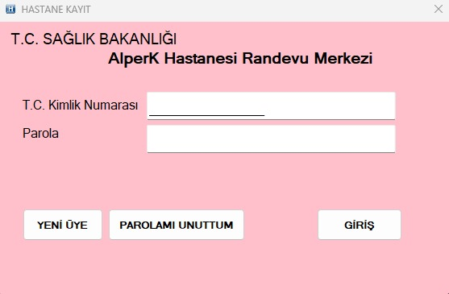
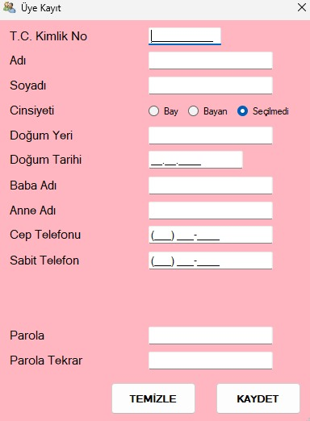
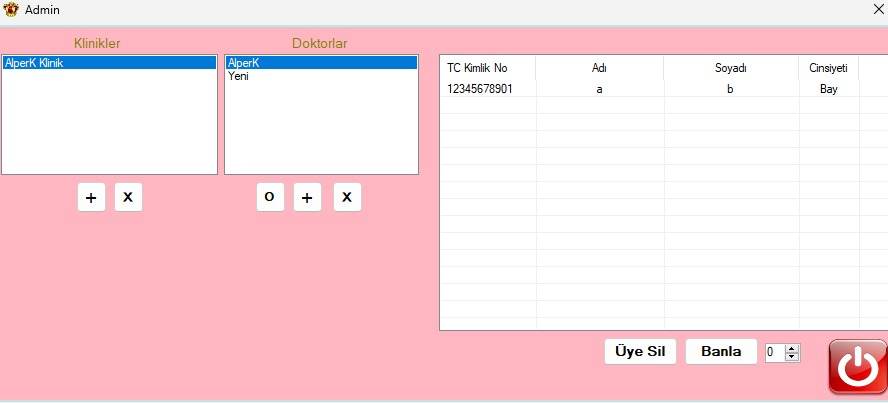
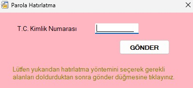
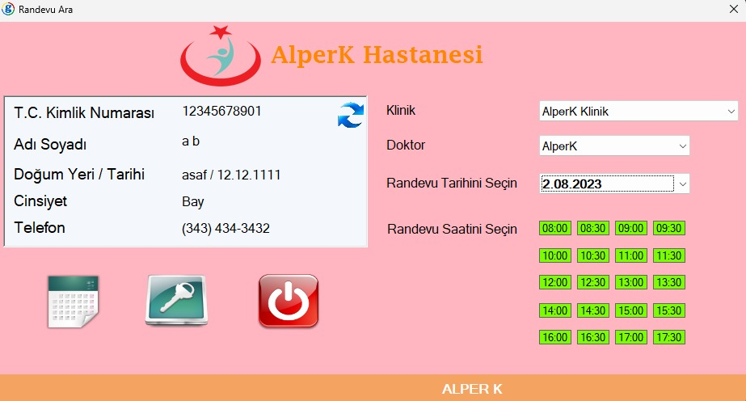
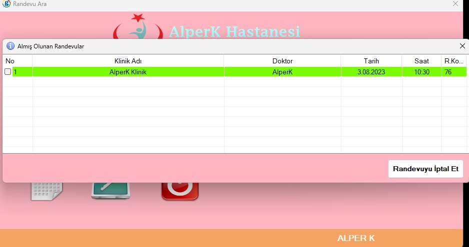

# Hospital-appointment-registration-system-with-Csharp
In this project, an interface was designed with C# where you can make an appointment from the hospital and cancel it by being a member of the system. In this interface, the admin can add and delete clinics and doctors to the system, and doctors can view and cancel their appointments.

